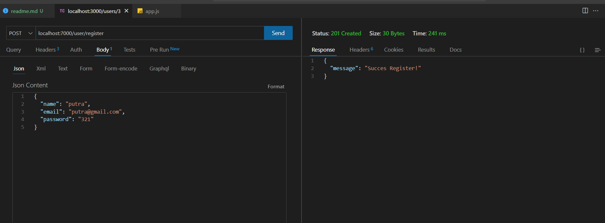
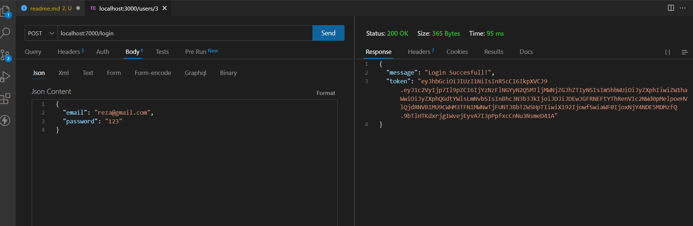
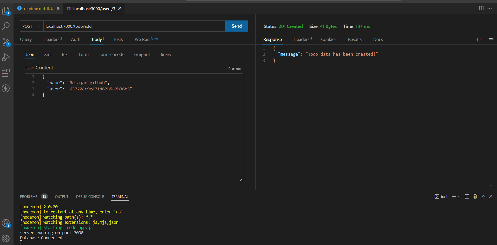
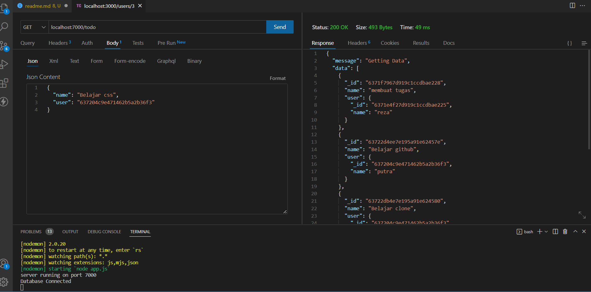
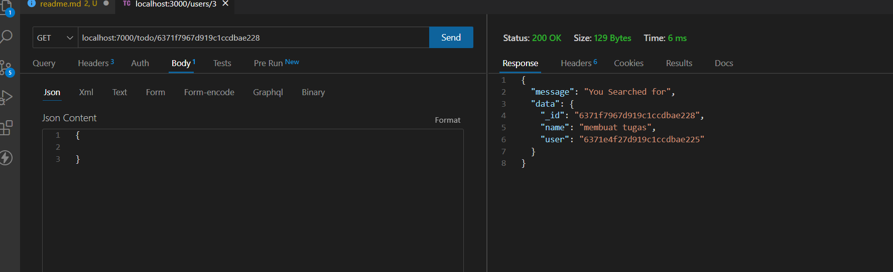
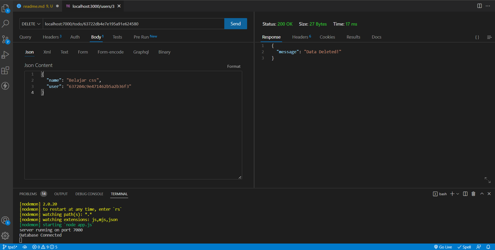
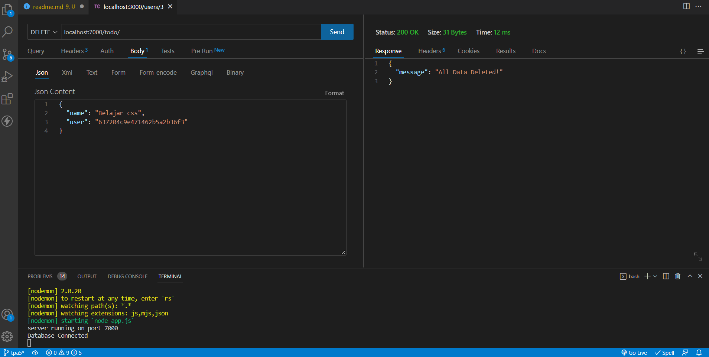

# Technical Project Assignment 5

## NPM Instal

- expressjs
- nodemon
- mongoose
- jsonwebtoken
- bcrypt
- dotenv

## Register

1. Mengirim data register.  
   

## Login

1. Mengirim data Login.  
   

## Todo

1. Membuat todo.
   

2. Menampilkan todo.
   

3. Menampilkan todo dengan ID.
   

4. Delete by ID.
   

5. Delete all.
   
